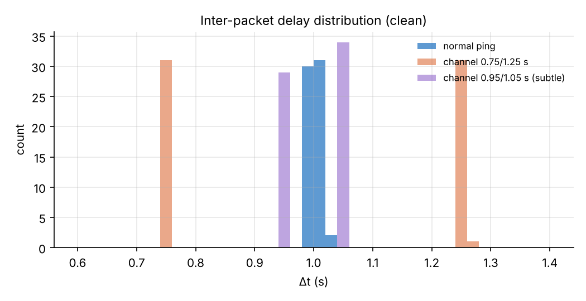
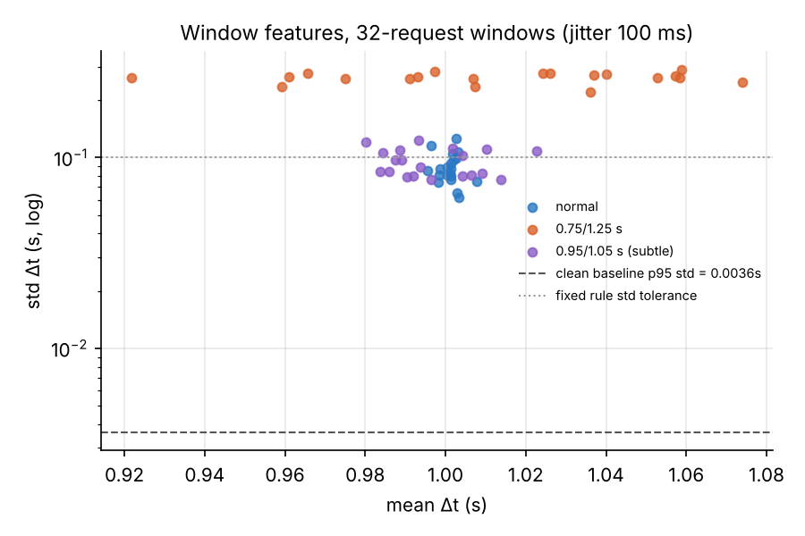
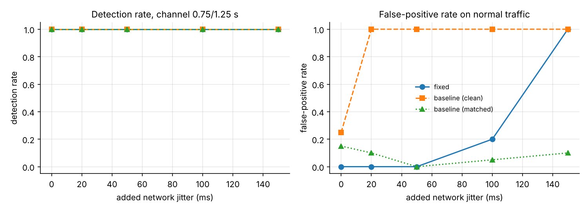
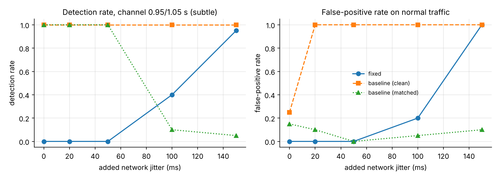
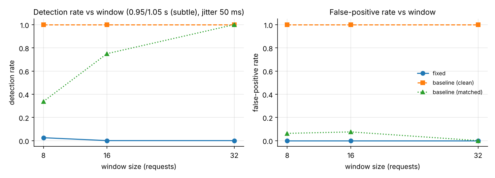

# Detection results (SIMULATED traces)

> These numbers come from the offline simulator in `icmp_detector/simulate.py`,
> not from the lab testbed. Replace them with real captures before quoting them as results.

- Runs per set: 10 x 64 Echo Requests
- Baseline: clean normal runs, p95 of window std (20 windows of 32 requests) = 0.0036 s
- Fixed rule: std > 0.1 s or |mean - 1.0| > 0.1 s

## Channel 0.75/1.25 s, 32-request windows

| condition | detector | detection rate | false-positive rate | windows (ch/normal) |
|---|---|---|---|---|
| clean | fixed | 1.00 | 0.00 | 20/20 |
| clean | baseline (clean) | 1.00 | 0.25 | 20/20 |
| clean | baseline (matched) | 1.00 | 0.15 | 20/20 |
| jitter 20 ms | fixed | 1.00 | 0.00 | 20/20 |
| jitter 20 ms | baseline (clean) | 1.00 | 1.00 | 20/20 |
| jitter 20 ms | baseline (matched) | 1.00 | 0.10 | 20/20 |
| jitter 50 ms | fixed | 1.00 | 0.00 | 20/20 |
| jitter 50 ms | baseline (clean) | 1.00 | 1.00 | 20/20 |
| jitter 50 ms | baseline (matched) | 1.00 | 0.00 | 20/20 |
| jitter 100 ms | fixed | 1.00 | 0.20 | 20/20 |
| jitter 100 ms | baseline (clean) | 1.00 | 1.00 | 20/20 |
| jitter 100 ms | baseline (matched) | 1.00 | 0.05 | 20/20 |
| jitter 150 ms | fixed | 1.00 | 1.00 | 20/20 |
| jitter 150 ms | baseline (clean) | 1.00 | 1.00 | 20/20 |
| jitter 150 ms | baseline (matched) | 1.00 | 0.10 | 20/20 |
| loss 5% | fixed | 1.00 | 0.00 | 10/12 |
| loss 5% | baseline (clean) | 1.00 | 0.17 | 10/12 |
| loss 5% | baseline (matched) | 1.00 | 0.08 | 10/12 |

Decoding accuracy (bits recovered correctly):

- clean: 100.0%
- jitter 20 ms: 100.0%
- jitter 50 ms: 100.0%
- jitter 100 ms: 99.2%
- jitter 150 ms: 97.5%
- loss 5%: 89.5%

## Channel 0.95/1.05 s (subtle), 32-request windows

| condition | detector | detection rate | false-positive rate | windows (ch/normal) |
|---|---|---|---|---|
| clean | fixed | 0.00 | 0.00 | 20/20 |
| clean | baseline (clean) | 1.00 | 0.25 | 20/20 |
| clean | baseline (matched) | 1.00 | 0.15 | 20/20 |
| jitter 20 ms | fixed | 0.00 | 0.00 | 20/20 |
| jitter 20 ms | baseline (clean) | 1.00 | 1.00 | 20/20 |
| jitter 20 ms | baseline (matched) | 1.00 | 0.10 | 20/20 |
| jitter 50 ms | fixed | 0.00 | 0.00 | 20/20 |
| jitter 50 ms | baseline (clean) | 1.00 | 1.00 | 20/20 |
| jitter 50 ms | baseline (matched) | 1.00 | 0.00 | 20/20 |
| jitter 100 ms | fixed | 0.40 | 0.20 | 20/20 |
| jitter 100 ms | baseline (clean) | 1.00 | 1.00 | 20/20 |
| jitter 100 ms | baseline (matched) | 0.10 | 0.05 | 20/20 |
| jitter 150 ms | fixed | 0.95 | 1.00 | 20/20 |
| jitter 150 ms | baseline (clean) | 1.00 | 1.00 | 20/20 |
| jitter 150 ms | baseline (matched) | 0.05 | 0.10 | 20/20 |
| loss 5% | fixed | 0.00 | 0.00 | 10/12 |
| loss 5% | baseline (clean) | 1.00 | 0.17 | 10/12 |
| loss 5% | baseline (matched) | 1.00 | 0.08 | 10/12 |

Decoding accuracy (bits recovered correctly):

- clean: 100.0%
- jitter 20 ms: 99.4%
- jitter 50 ms: 87.6%
- jitter 100 ms: 74.8%
- jitter 150 ms: 68.4%
- loss 5%: 90.6%

## Figures

