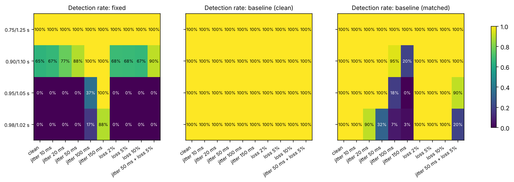
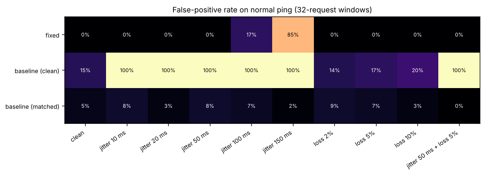
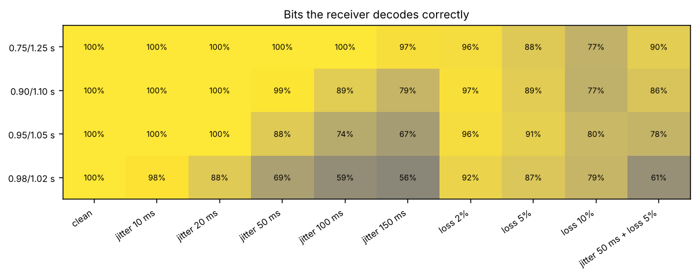

# Benchmarks (SIMULATED traces)

> The accuracy numbers come from the offline simulator (`icmp_detector/simulate.py`), not from the
> lab testbed. Rerun `python -m icmp_detector benchmark` on real captures before quoting them as results.

- 30 runs x 64 Echo Requests for every normal and covert set, seed 11
- Fixed rule: std > 0.1 s or |mean - 1| > 0.1 s. Baselines: p95 of window std from clean normal runs, or from normal runs under the same conditions (matched).

## 1. Who catches what

Detection rate (DR) on covert windows and false-positive rate (FPR) on normal windows, 32-request windows. A detector is only useful when DR is high and FPR is low at the same time.

| gaps | network | DR fixed | DR clean | DR matched | FPR fixed | FPR clean | FPR matched | bits decoded |
|---|---|---|---|---|---|---|---|---|
| 0.75/1.25 s | clean | 100% | 100% | 100% | 0% | 15% | 5% | 100% |
| 0.75/1.25 s | jitter 10 ms | 100% | 100% | 100% | 0% | 100% | 8% | 100% |
| 0.75/1.25 s | jitter 20 ms | 100% | 100% | 100% | 0% | 100% | 3% | 100% |
| 0.75/1.25 s | jitter 50 ms | 100% | 100% | 100% | 0% | 100% | 8% | 100% |
| 0.75/1.25 s | jitter 100 ms | 100% | 100% | 100% | 17% | 100% | 7% | 100% |
| 0.75/1.25 s | jitter 150 ms | 100% | 100% | 100% | 85% | 100% | 2% | 97% |
| 0.75/1.25 s | loss 2% | 100% | 100% | 100% | 0% | 14% | 9% | 96% |
| 0.75/1.25 s | loss 5% | 100% | 100% | 100% | 0% | 17% | 7% | 88% |
| 0.75/1.25 s | loss 10% | 100% | 100% | 100% | 0% | 20% | 3% | 77% |
| 0.75/1.25 s | jitter 50 ms + loss 5% | 100% | 100% | 100% | 0% | 100% | 0% | 90% |
| 0.90/1.10 s | clean | 65% | 100% | 100% | 0% | 15% | 5% | 100% |
| 0.90/1.10 s | jitter 10 ms | 67% | 100% | 100% | 0% | 100% | 8% | 100% |
| 0.90/1.10 s | jitter 20 ms | 77% | 100% | 100% | 0% | 100% | 3% | 100% |
| 0.90/1.10 s | jitter 50 ms | 88% | 100% | 100% | 0% | 100% | 8% | 99% |
| 0.90/1.10 s | jitter 100 ms | 100% | 100% | 95% | 17% | 100% | 7% | 89% |
| 0.90/1.10 s | jitter 150 ms | 100% | 100% | 20% | 85% | 100% | 2% | 79% |
| 0.90/1.10 s | loss 2% | 68% | 100% | 100% | 0% | 14% | 9% | 97% |
| 0.90/1.10 s | loss 5% | 68% | 100% | 100% | 0% | 17% | 7% | 89% |
| 0.90/1.10 s | loss 10% | 67% | 100% | 100% | 0% | 20% | 3% | 77% |
| 0.90/1.10 s | jitter 50 ms + loss 5% | 90% | 100% | 100% | 0% | 100% | 0% | 86% |
| 0.95/1.05 s | clean | 0% | 100% | 100% | 0% | 15% | 5% | 100% |
| 0.95/1.05 s | jitter 10 ms | 0% | 100% | 100% | 0% | 100% | 8% | 100% |
| 0.95/1.05 s | jitter 20 ms | 0% | 100% | 100% | 0% | 100% | 3% | 100% |
| 0.95/1.05 s | jitter 50 ms | 0% | 100% | 100% | 0% | 100% | 8% | 88% |
| 0.95/1.05 s | jitter 100 ms | 37% | 100% | 18% | 17% | 100% | 7% | 74% |
| 0.95/1.05 s | jitter 150 ms | 100% | 100% | 0% | 85% | 100% | 2% | 67% |
| 0.95/1.05 s | loss 2% | 0% | 100% | 100% | 0% | 14% | 9% | 96% |
| 0.95/1.05 s | loss 5% | 0% | 100% | 100% | 0% | 17% | 7% | 91% |
| 0.95/1.05 s | loss 10% | 0% | 100% | 100% | 0% | 20% | 3% | 80% |
| 0.95/1.05 s | jitter 50 ms + loss 5% | 0% | 100% | 90% | 0% | 100% | 0% | 78% |
| 0.98/1.02 s | clean | 0% | 100% | 100% | 0% | 15% | 5% | 100% |
| 0.98/1.02 s | jitter 10 ms | 0% | 100% | 100% | 0% | 100% | 8% | 98% |
| 0.98/1.02 s | jitter 20 ms | 0% | 100% | 90% | 0% | 100% | 3% | 88% |
| 0.98/1.02 s | jitter 50 ms | 0% | 100% | 32% | 0% | 100% | 8% | 69% |
| 0.98/1.02 s | jitter 100 ms | 17% | 100% | 7% | 17% | 100% | 7% | 59% |
| 0.98/1.02 s | jitter 150 ms | 88% | 100% | 3% | 85% | 100% | 2% | 56% |
| 0.98/1.02 s | loss 2% | 0% | 100% | 100% | 0% | 14% | 9% | 92% |
| 0.98/1.02 s | loss 5% | 0% | 100% | 100% | 0% | 17% | 7% | 87% |
| 0.98/1.02 s | loss 10% | 0% | 100% | 100% | 0% | 20% | 3% | 79% |
| 0.98/1.02 s | jitter 50 ms + loss 5% | 0% | 100% | 20% | 0% | 100% | 0% | 61% |

## 2. Window size

Matched baseline, DR / FPR by window size. Bigger windows average out noise but take longer to fill (one request per second).

| gaps | network | 8 requests | 16 requests | 32 requests |
|---|---|---|---|---|
| 0.75/1.25 s | clean | 98% / 6% | 100% / 3% | 100% / 5% |
| 0.75/1.25 s | jitter 50 ms | 99% / 4% | 100% / 6% | 100% / 8% |
| 0.90/1.10 s | clean | 98% / 6% | 100% / 3% | 100% / 5% |
| 0.90/1.10 s | jitter 50 ms | 97% / 4% | 100% / 6% | 100% / 8% |
| 0.95/1.05 s | clean | 98% / 6% | 100% / 3% | 100% / 5% |
| 0.95/1.05 s | jitter 50 ms | 44% / 4% | 71% / 6% | 100% / 8% |
| 0.98/1.02 s | clean | 98% / 6% | 100% / 3% | 100% / 5% |
| 0.98/1.02 s | jitter 50 ms | 10% / 4% | 13% / 6% | 32% / 8% |

## 3. Speed

One capture of 100,000 Echo Requests (3,125 windows of 32), best of 3 runs on x86_64, Python 3.13.16.

| stage | time | per window |
|---|---|---|
| load tshark CSV | 226 ms | 72 µs |
| split into 32-request windows | 28 ms | 9 µs |
| features + baseline decision | 414 ms | 132 µs |
| features + fixed-rule decision | 313 ms | 100 µs |
| decode bits | 69 ms | 22 µs |

- End to end (load, window, baseline decision): **149,634 packets/s**.
- A 32-request window takes 31 s to fill at one ping per second and 132 µs to judge, so one core keeps up with about **234,238 flows at once**.

## Figures

