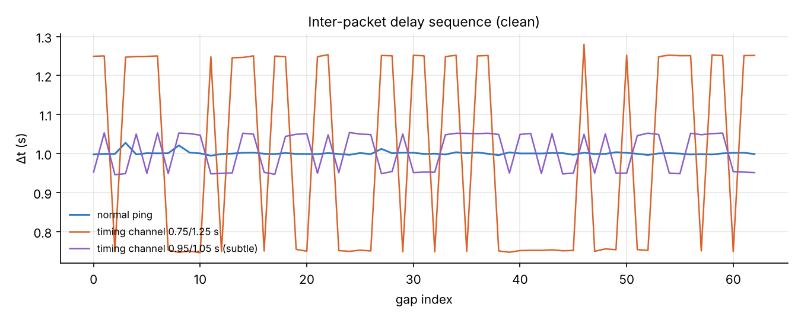
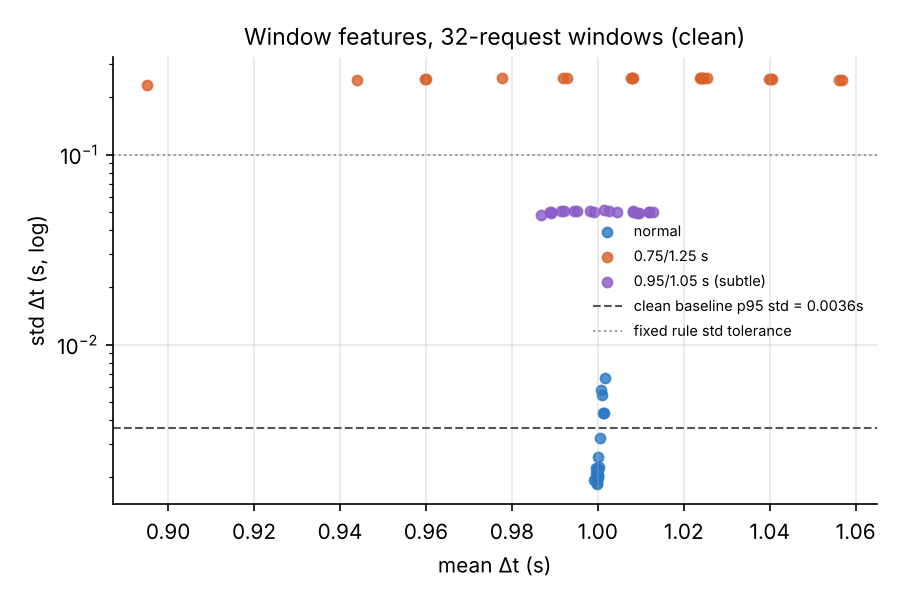
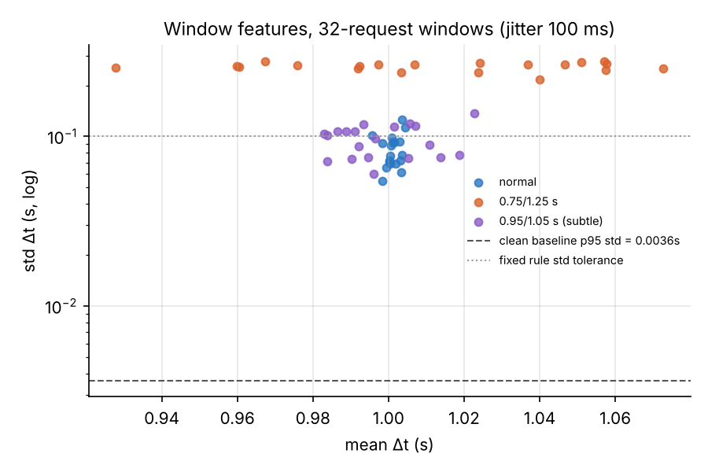
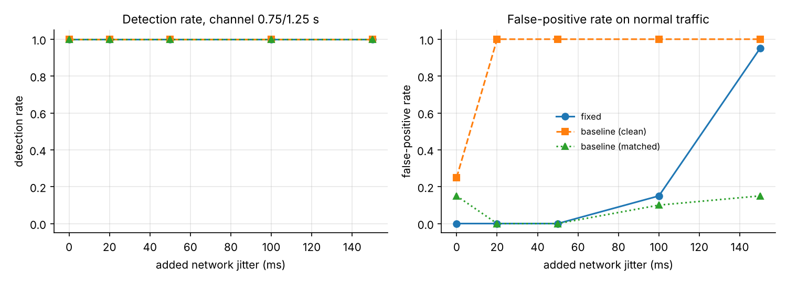
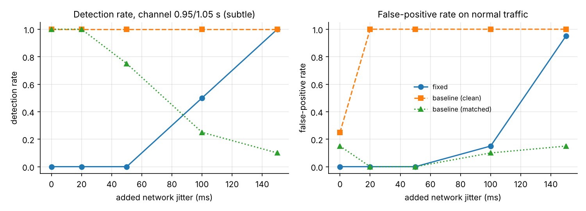
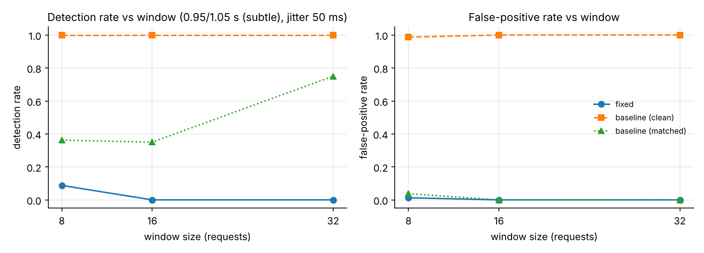

# Detection results (SIMULATED traces)

> These numbers come from the offline simulator in `icmp_detector/simulate.py`,
> not from the lab testbed. Replace them with real captures before quoting them as results.

- Runs per set: 10 x 64 Echo Requests
- Baseline: clean normal runs, p95 of window std (20 windows of 32 requests) = 0.0036 s
- Fixed rule: std > 0.1 s or |mean - 1.0| > 0.1 s
- Simulated network delay model: `netem` (see `icmp_detector/simulate.py`)

Brackets are 95% bootstrap intervals that resample whole runs (10 runs per set).

## Channel 0.75/1.25 s, 32-request windows

| condition | detector | detection rate | false-positive rate | windows (ch/normal) |
|---|---|---|---|---|
| clean | fixed | 1.00 [1.00, 1.00] | 0.00 [0.00, 0.00] | 20/20 |
| clean | baseline (clean) | 1.00 [1.00, 1.00] | 0.25 [0.10, 0.40] | 20/20 |
| clean | baseline (matched) | 1.00 [1.00, 1.00] | 0.15 [0.05, 0.30] | 20/20 |
| jitter 20 ms | fixed | 1.00 [1.00, 1.00] | 0.00 [0.00, 0.00] | 20/20 |
| jitter 20 ms | baseline (clean) | 1.00 [1.00, 1.00] | 1.00 [1.00, 1.00] | 20/20 |
| jitter 20 ms | baseline (matched) | 1.00 [1.00, 1.00] | 0.00 [0.00, 0.00] | 20/20 |
| jitter 50 ms | fixed | 1.00 [1.00, 1.00] | 0.00 [0.00, 0.00] | 20/20 |
| jitter 50 ms | baseline (clean) | 1.00 [1.00, 1.00] | 1.00 [1.00, 1.00] | 20/20 |
| jitter 50 ms | baseline (matched) | 1.00 [1.00, 1.00] | 0.00 [0.00, 0.00] | 20/20 |
| jitter 100 ms | fixed | 1.00 [1.00, 1.00] | 0.15 [0.00, 0.30] | 20/20 |
| jitter 100 ms | baseline (clean) | 1.00 [1.00, 1.00] | 1.00 [1.00, 1.00] | 20/20 |
| jitter 100 ms | baseline (matched) | 1.00 [1.00, 1.00] | 0.10 [0.00, 0.25] | 20/20 |
| jitter 150 ms | fixed | 1.00 [1.00, 1.00] | 0.95 [0.85, 1.00] | 20/20 |
| jitter 150 ms | baseline (clean) | 1.00 [1.00, 1.00] | 1.00 [1.00, 1.00] | 20/20 |
| jitter 150 ms | baseline (matched) | 1.00 [1.00, 1.00] | 0.15 [0.00, 0.30] | 20/20 |
| loss 5% | fixed | 1.00 [1.00, 1.00] | 0.00 [0.00, 0.00] | 10/12 |
| loss 5% | baseline (clean) | 1.00 [1.00, 1.00] | 0.17 [0.00, 0.40] | 10/12 |
| loss 5% | baseline (matched) | 1.00 [1.00, 1.00] | 0.08 [0.00, 0.30] | 10/12 |

Decoding accuracy (bits recovered correctly):

- clean: 100.0%
- jitter 20 ms: 100.0%
- jitter 50 ms: 100.0%
- jitter 100 ms: 99.5%
- jitter 150 ms: 96.2%
- loss 5%: 89.5%

## Channel 0.95/1.05 s (subtle), 32-request windows

| condition | detector | detection rate | false-positive rate | windows (ch/normal) |
|---|---|---|---|---|
| clean | fixed | 0.00 [0.00, 0.00] | 0.00 [0.00, 0.00] | 20/20 |
| clean | baseline (clean) | 1.00 [1.00, 1.00] | 0.25 [0.10, 0.40] | 20/20 |
| clean | baseline (matched) | 1.00 [1.00, 1.00] | 0.15 [0.05, 0.30] | 20/20 |
| jitter 20 ms | fixed | 0.00 [0.00, 0.00] | 0.00 [0.00, 0.00] | 20/20 |
| jitter 20 ms | baseline (clean) | 1.00 [1.00, 1.00] | 1.00 [1.00, 1.00] | 20/20 |
| jitter 20 ms | baseline (matched) | 1.00 [1.00, 1.00] | 0.00 [0.00, 0.00] | 20/20 |
| jitter 50 ms | fixed | 0.00 [0.00, 0.00] | 0.00 [0.00, 0.00] | 20/20 |
| jitter 50 ms | baseline (clean) | 1.00 [1.00, 1.00] | 1.00 [1.00, 1.00] | 20/20 |
| jitter 50 ms | baseline (matched) | 0.75 [0.55, 0.95] | 0.00 [0.00, 0.00] | 20/20 |
| jitter 100 ms | fixed | 0.50 [0.25, 0.75] | 0.15 [0.00, 0.30] | 20/20 |
| jitter 100 ms | baseline (clean) | 1.00 [1.00, 1.00] | 1.00 [1.00, 1.00] | 20/20 |
| jitter 100 ms | baseline (matched) | 0.25 [0.05, 0.45] | 0.10 [0.00, 0.25] | 20/20 |
| jitter 150 ms | fixed | 1.00 [1.00, 1.00] | 0.95 [0.85, 1.00] | 20/20 |
| jitter 150 ms | baseline (clean) | 1.00 [1.00, 1.00] | 1.00 [1.00, 1.00] | 20/20 |
| jitter 150 ms | baseline (matched) | 0.10 [0.00, 0.23] | 0.15 [0.00, 0.30] | 20/20 |
| loss 5% | fixed | 0.00 [0.00, 0.00] | 0.00 [0.00, 0.00] | 10/12 |
| loss 5% | baseline (clean) | 1.00 [1.00, 1.00] | 0.17 [0.00, 0.40] | 10/12 |
| loss 5% | baseline (matched) | 1.00 [1.00, 1.00] | 0.08 [0.00, 0.30] | 10/12 |

Decoding accuracy (bits recovered correctly):

- clean: 100.0%
- jitter 20 ms: 99.5%
- jitter 50 ms: 89.7%
- jitter 100 ms: 74.8%
- jitter 150 ms: 75.4%
- loss 5%: 90.6%

## Figures

## Spread across seeds (7, 8, 9, 10, 11), 32-request windows

Mean, and min-max over seeds, of each rate. A wide range means one seed's table above should not be quoted alone.

| channel | condition | detector | DR mean (min-max) | FPR mean (min-max) |
|---|---|---|---|---|
| 0.75/1.25 s | clean | fixed | 1.00 (1.00-1.00) | 0.00 (0.00-0.00) |
| 0.75/1.25 s | clean | baseline (clean) | 1.00 (1.00-1.00) | 0.14 (0.05-0.25) |
| 0.75/1.25 s | clean | baseline (matched) | 1.00 (1.00-1.00) | 0.09 (0.05-0.15) |
| 0.95/1.05 s (subtle) | clean | fixed | 0.00 (0.00-0.00) | 0.00 (0.00-0.00) |
| 0.95/1.05 s (subtle) | clean | baseline (clean) | 1.00 (1.00-1.00) | 0.14 (0.05-0.25) |
| 0.95/1.05 s (subtle) | clean | baseline (matched) | 1.00 (1.00-1.00) | 0.09 (0.05-0.15) |
| 0.75/1.25 s | jitter 20 ms | fixed | 1.00 (1.00-1.00) | 0.00 (0.00-0.00) |
| 0.75/1.25 s | jitter 20 ms | baseline (clean) | 1.00 (1.00-1.00) | 1.00 (1.00-1.00) |
| 0.75/1.25 s | jitter 20 ms | baseline (matched) | 1.00 (1.00-1.00) | 0.07 (0.00-0.25) |
| 0.95/1.05 s (subtle) | jitter 20 ms | fixed | 0.00 (0.00-0.00) | 0.00 (0.00-0.00) |
| 0.95/1.05 s (subtle) | jitter 20 ms | baseline (clean) | 1.00 (1.00-1.00) | 1.00 (1.00-1.00) |
| 0.95/1.05 s (subtle) | jitter 20 ms | baseline (matched) | 1.00 (1.00-1.00) | 0.07 (0.00-0.25) |
| 0.75/1.25 s | jitter 50 ms | fixed | 1.00 (1.00-1.00) | 0.00 (0.00-0.00) |
| 0.75/1.25 s | jitter 50 ms | baseline (clean) | 1.00 (1.00-1.00) | 1.00 (1.00-1.00) |
| 0.75/1.25 s | jitter 50 ms | baseline (matched) | 1.00 (1.00-1.00) | 0.04 (0.00-0.10) |
| 0.95/1.05 s (subtle) | jitter 50 ms | fixed | 0.00 (0.00-0.00) | 0.00 (0.00-0.00) |
| 0.95/1.05 s (subtle) | jitter 50 ms | baseline (clean) | 1.00 (1.00-1.00) | 1.00 (1.00-1.00) |
| 0.95/1.05 s (subtle) | jitter 50 ms | baseline (matched) | 0.89 (0.75-1.00) | 0.04 (0.00-0.10) |
| 0.75/1.25 s | jitter 100 ms | fixed | 1.00 (1.00-1.00) | 0.15 (0.05-0.40) |
| 0.75/1.25 s | jitter 100 ms | baseline (clean) | 1.00 (1.00-1.00) | 1.00 (1.00-1.00) |
| 0.75/1.25 s | jitter 100 ms | baseline (matched) | 1.00 (1.00-1.00) | 0.06 (0.00-0.20) |
| 0.95/1.05 s (subtle) | jitter 100 ms | fixed | 0.42 (0.30-0.50) | 0.15 (0.05-0.40) |
| 0.95/1.05 s (subtle) | jitter 100 ms | baseline (clean) | 1.00 (1.00-1.00) | 1.00 (1.00-1.00) |
| 0.95/1.05 s (subtle) | jitter 100 ms | baseline (matched) | 0.15 (0.00-0.30) | 0.06 (0.00-0.20) |
| 0.75/1.25 s | jitter 150 ms | fixed | 1.00 (1.00-1.00) | 0.82 (0.70-0.95) |
| 0.75/1.25 s | jitter 150 ms | baseline (clean) | 1.00 (1.00-1.00) | 1.00 (1.00-1.00) |
| 0.75/1.25 s | jitter 150 ms | baseline (matched) | 1.00 (1.00-1.00) | 0.19 (0.05-0.30) |
| 0.95/1.05 s (subtle) | jitter 150 ms | fixed | 0.95 (0.90-1.00) | 0.82 (0.70-0.95) |
| 0.95/1.05 s (subtle) | jitter 150 ms | baseline (clean) | 1.00 (1.00-1.00) | 1.00 (1.00-1.00) |
| 0.95/1.05 s (subtle) | jitter 150 ms | baseline (matched) | 0.11 (0.05-0.20) | 0.19 (0.05-0.30) |
| 0.75/1.25 s | loss 5% | fixed | 1.00 (1.00-1.00) | 0.00 (0.00-0.00) |
| 0.75/1.25 s | loss 5% | baseline (clean) | 1.00 (1.00-1.00) | 0.11 (0.09-0.17) |
| 0.75/1.25 s | loss 5% | baseline (matched) | 1.00 (1.00-1.00) | 0.07 (0.00-0.10) |
| 0.95/1.05 s (subtle) | loss 5% | fixed | 0.00 (0.00-0.00) | 0.00 (0.00-0.00) |
| 0.95/1.05 s (subtle) | loss 5% | baseline (clean) | 1.00 (1.00-1.00) | 0.11 (0.09-0.17) |
| 0.95/1.05 s (subtle) | loss 5% | baseline (matched) | 1.00 (1.00-1.00) | 0.07 (0.00-0.10) |
